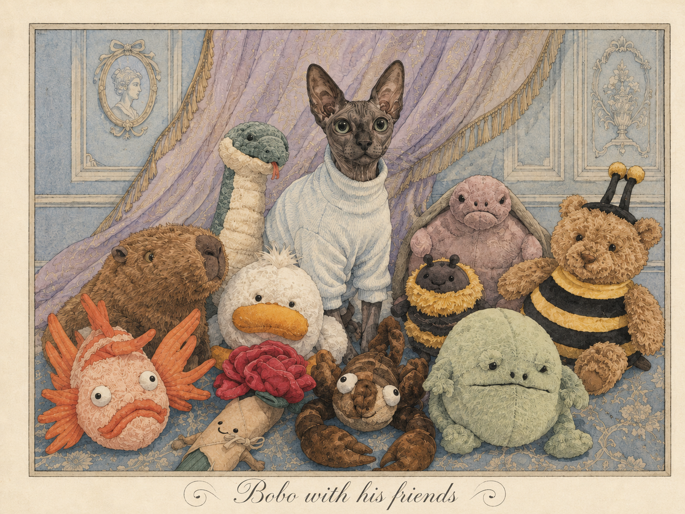
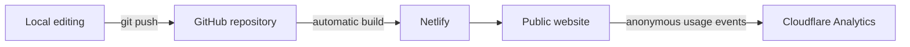

# Life of Bobo

[](https://life-of-bobo.netlify.app/)
[](https://gohugo.io/)
[](https://www.netlify.com/)

**Life of Bobo** is a bilingual, illustrated archive of Bobo, a Sphynx cat with a large wardrobe, strong food opinions, and a talent for supervising his roommates.

The site combines personal storytelling, photography, video, and original artwork in a responsive English/Chinese experience. It began with the [Hugo Apéro](https://github.com/hugo-apero/hugo-apero) theme and has been extended with custom layouts, reusable media components, responsive styling, interactive JavaScript, and continuous deployment.

**[Visit the live website →](https://life-of-bobo.netlify.app/)**



## Highlights

- **Bilingual content:** English and Simplified Chinese pages with a route-aware language switcher.
- **Stories:** Long-form narratives combining photographs, captions, paired media, alternating image-and-text rows, and embedded video.
- **Lookbook:** A catalog of 26 outfits with consistent illustrated covers, metadata, and responsive cards.
- **Adventures:** Birthday and travel stories presented through a custom chronological layout and checklist sidebar.
- **Bobo's Menu:** An illustrated, expandable guide to foods Bobo loves, refuses, or should avoid.
- **Interactive roommates:** Clicking a roommate portrait triggers a custom icon-rain animation, with reduced-motion support for accessibility.
- **Responsive design:** Custom layouts adapt across desktop and mobile screens.
- **Privacy-first analytics:** Cloudflare Web Analytics measures site usage without exposing the analytics dashboard publicly.

## What I Customized

This project uses Hugo Apéro as its foundation. The work specific to Life of Bobo includes:

- a bilingual navigation system that links corresponding translations and falls back safely when a translation is unavailable;
- custom Hugo templates for the Stories, Lookbook, and Adventures landing pages;
- reusable Hugo shortcodes for single images, videos, alternating media rows, paired media, and three-image layouts;
- custom SCSS for typography, story framing, responsive galleries, the roommates sidebar, and mobile behavior;
- JavaScript interactions for the roommate portrait effects;
- a custom illustrated food-menu interface;
- original site structure, writing, translation, visual direction, and image curation;
- automated deployment through GitHub and Netlify; and
- Cloudflare Web Analytics integration.

## Technology

| Area | Tools |
|---|---|
| Static site generation | Hugo Extended |
| Theme foundation | Hugo Apéro |
| Templates and content | Go templates, HTML, Markdown |
| Styling | SCSS/CSS, Tachyons utilities, Fredoka typography |
| Interactions | Vanilla JavaScript |
| Authoring | RStudio and local text editors |
| Version control | Git and GitHub |
| Deployment | Netlify continuous deployment |
| Analytics | Cloudflare Web Analytics |

## How It Works



GitHub stores the source files and revision history. Netlify watches the `main` branch, runs Hugo after each push, and publishes the generated static site. The Cloudflare beacon is included in the built pages, while the collected analytics remain private in the Cloudflare account.

## Project Structure

```text
.
├── assets/
│   ├── custom.scss          # Site-specific responsive styling
│   └── theme/               # Theme palettes
├── content/
│   ├── Adventure/           # Birthday and travel stories
│   ├── about/               # Bobo and roommate profiles
│   ├── blog/                # English and Chinese stories
│   ├── collection/          # Illustrated food menu
│   └── project/             # Lookbook entries
├── layouts/
│   ├── partials/            # Navigation, cards, and sidebar components
│   └── shortcodes/           # Reusable story media layouts
├── static/
│   ├── img/                 # Shared illustrations and interface assets
│   └── js/                  # Interactive roommate effects
├── config.toml                 # Hugo and bilingual-site configuration
└── netlify.toml                # Build and deployment configuration
```

English and Chinese versions are stored together using Hugo's multilingual content conventions, such as `index.md` and `index.zh.md`. Shared visual assets are reused across translations where appropriate.

## Run Locally

### Requirements

- Git
- [Hugo Extended](https://gohugo.io/installation/) (the deployed site currently uses Hugo `0.157.0`)

### Setup

```bash
git clone https://github.com/YawenZ-Chem/life-of-bobo.git
cd life-of-bobo
hugo server
```

Open [http://localhost:1313/](http://localhost:1313/) in a browser. Hugo watches the project files and rebuilds the local preview when changes are saved.

To generate a production build locally:

```bash
hugo
```

The generated site is written to `public/`, which is intentionally excluded from version control because Netlify rebuilds it during deployment.

## Deployment and Analytics

The repository is connected to Netlify for continuous deployment:

1. Changes are committed and pushed to `main`.
2. Netlify runs the build command defined in `netlify.toml`.
3. The completed site is published at [life-of-bobo.netlify.app](https://life-of-bobo.netlify.app/).

Cloudflare Web Analytics is loaded through the base Hugo template. Only the public beacon configuration is stored in this repository; visitor reports and dashboard access are not public.

## Credits

- Built with [Hugo](https://gohugo.io/).
- Theme foundation: [Hugo Apéro](https://github.com/hugo-apero/hugo-apero).
- Site concept, customization, writing, translation, visual direction, and content curation by Yawen Zhang.

