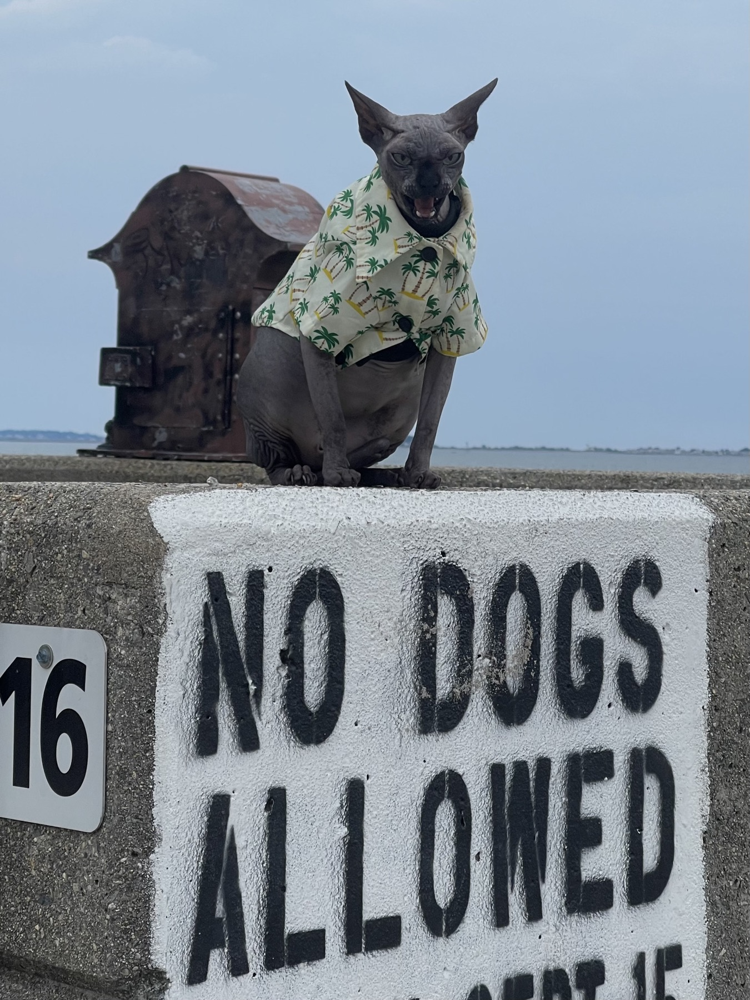
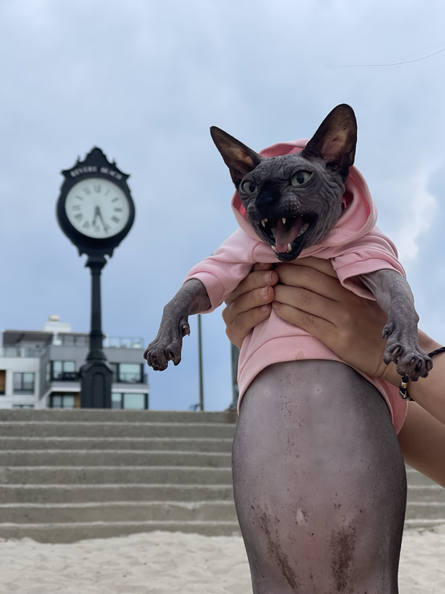
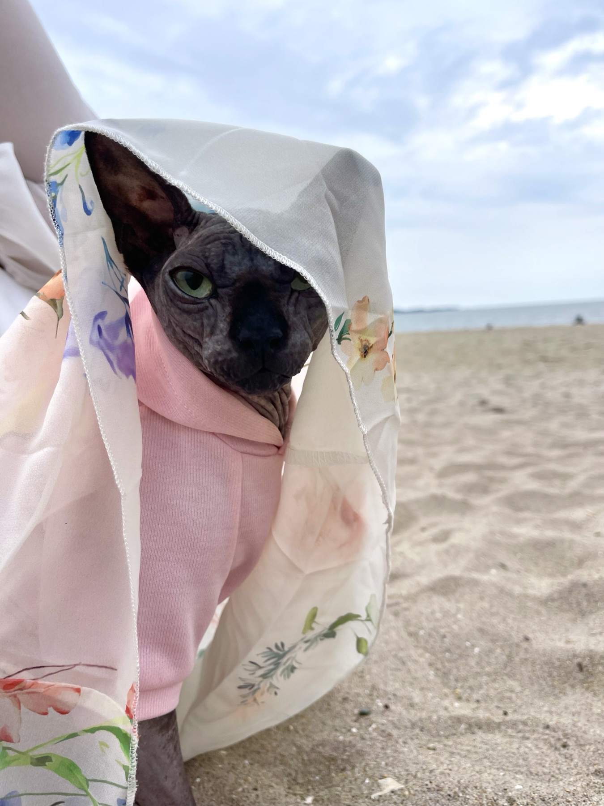
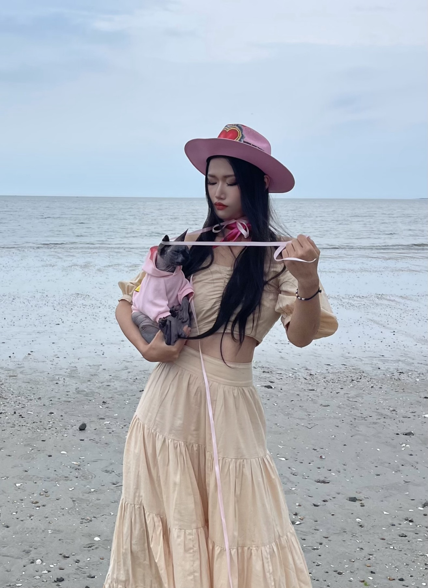
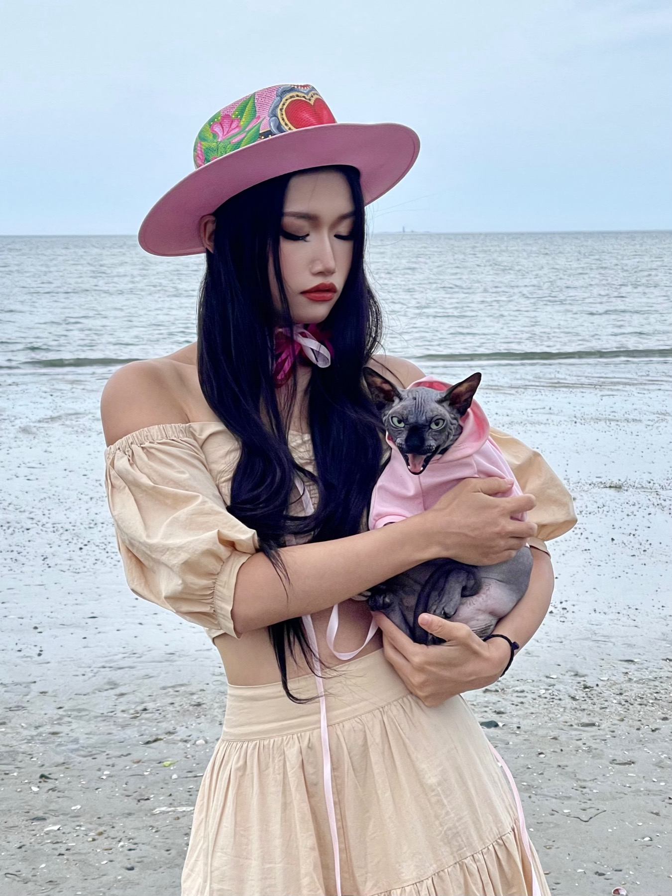
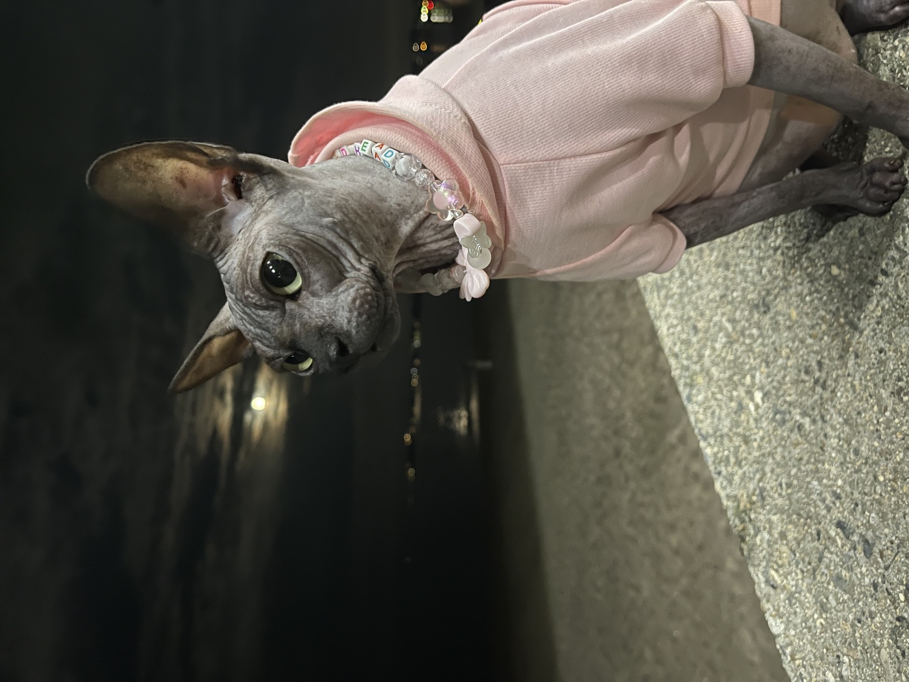
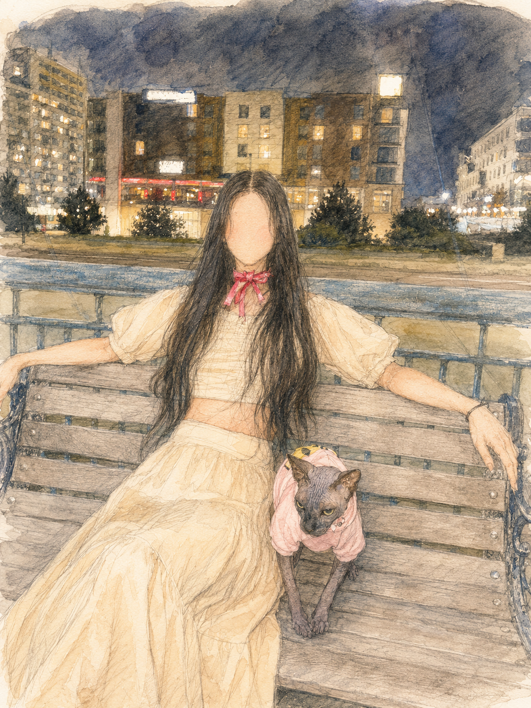
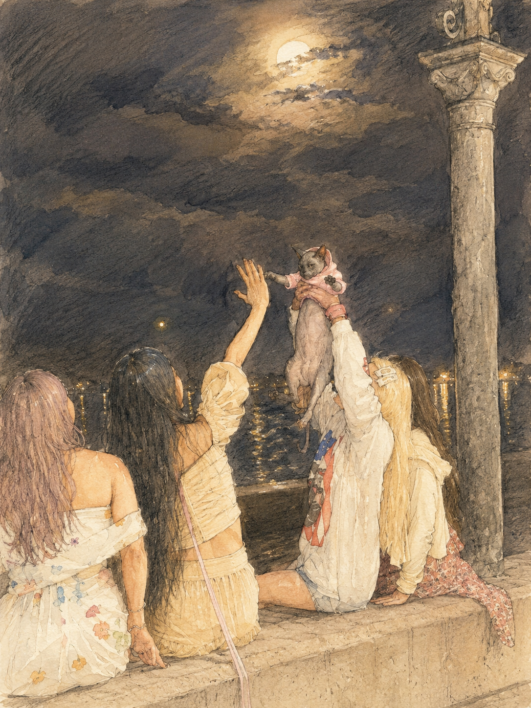

For his third birthday, Bobo was finally big and strong enough to begin exploring the world beyond home. We had heard the joke that cats might see a beach as one enormous litter box, so we decided that his first major birthday adventure should be a trip to the ocean.

<section class="birthday-story-section">
<figure class="birthday-story-photo left">

</figure>

We began with a signature photograph near the entrance. The sign clearly said that dogs were not allowed, but it said nothing about cats. As far as we were concerned, that meant Bobo was not merely permitted to enter—he was free to claim the beach as his own.

</section>

<section class="birthday-story-section">
<figure class="birthday-story-photo right">

</figure>

Next came the classic tourist photograph beside the landmark clock. Bobo arrived wearing his pink hoodie and immediately produced one of his most dramatic expressions. Whether it was excitement, confusion, or simply his model face, he looked prepared for a very memorable day.

</section>

<section class="birthday-story-section">
<figure class="birthday-story-photo left">

</figure>

The sand itself did not impress him very much. We were not sure whether he disliked the unfamiliar texture, felt overwhelmed by his first outdoor adventure, or was simply suspicious of the many seagulls circling nearby. Because he was still small, we stayed close and used a light floral covering to give him some shade and make him feel protected.

</section>

<section class="birthday-story-section">
<figure class="birthday-story-photo right">

</figure>

Taking birthday portraits beside the ocean was more difficult than expected. The wind kept lifting and twisting the long pink ribbon, occasionally wrapping it around Bobo instead of letting it fall neatly into place. We spent much of the photo session untangling it while Bobo waited with limited patience.

</section>

<section class="birthday-story-section">
<figure class="birthday-story-photo left">

</figure>

Eventually, everything stayed in place long enough for us to take the portrait we wanted. Our cream-and-pink outfits coordinated with Bobo’s hoodie, creating a photograph to remember the first time he saw the ocean—even though his expression suggested that he remained undecided about the entire experience.

</section>

<section class="birthday-story-section">
<figure class="birthday-story-photo right">

</figure>

As evening arrived, Bobo became noticeably calmer. The beach grew quieter, the air cooled, and the bright daytime activity faded into the distant lights across the water. He sat beside the shore in his pink hoodie and watched the darkness with a much more peaceful expression.

</section>

<section class="birthday-story-section">
<figure class="birthday-story-photo left">

</figure>

We took a break together near the promenade, where Bobo could sit beside us and observe the nighttime surroundings without having to walk through the sand. After the unfamiliar sights, sounds, wind, and seagulls of the afternoon, the quiet bench seemed to be much more his style.

</section>

<section class="birthday-story-section">
<figure class="birthday-story-photo right">

</figure>

Before leaving, we gathered beneath the moon and sang “Happy Birthday” to Bobo in our best meow-meow cat language. He was lifted into the center of the group while everyone joined in, giving the day one final celebration before we sat by the water and relaxed together.

Bobo may not have decided that the beach was a giant litter box, but his third birthday became his first real adventure into the larger world—and the first time he saw the ocean.

</section>

