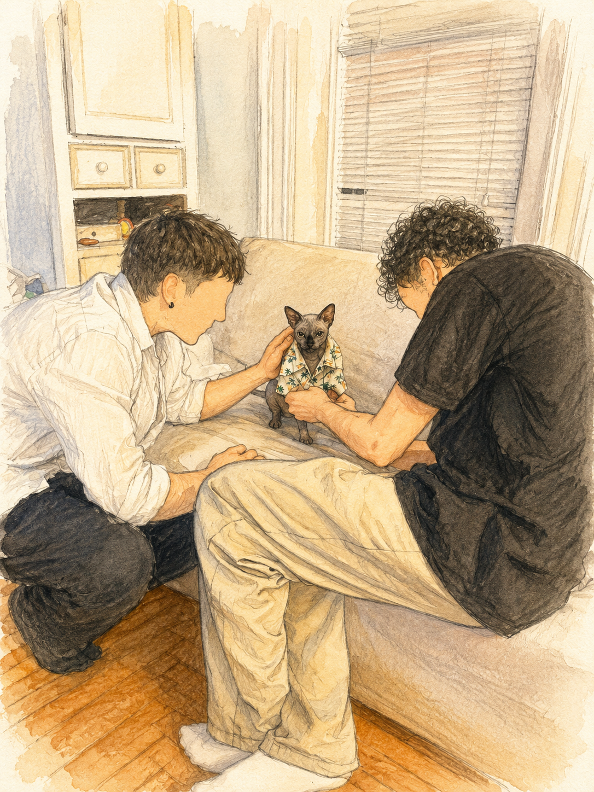
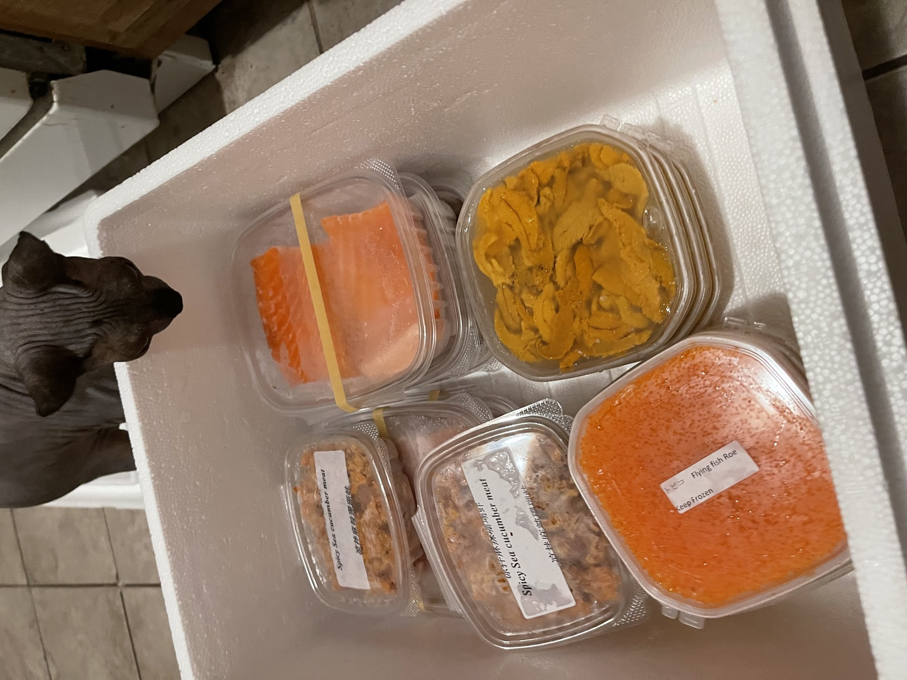
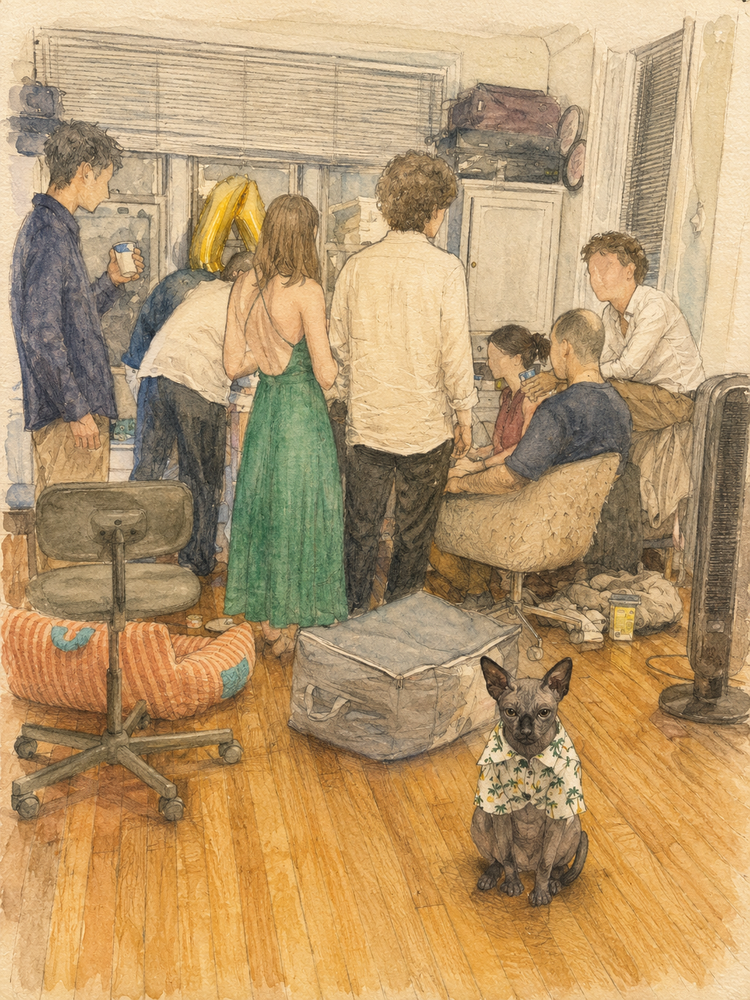
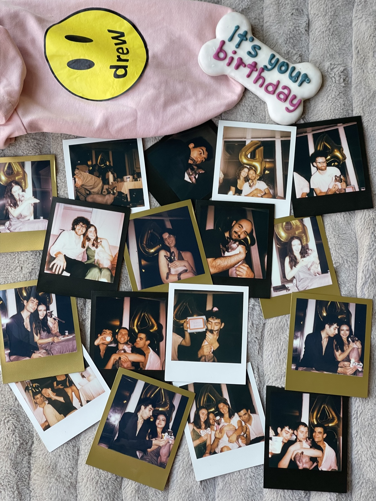
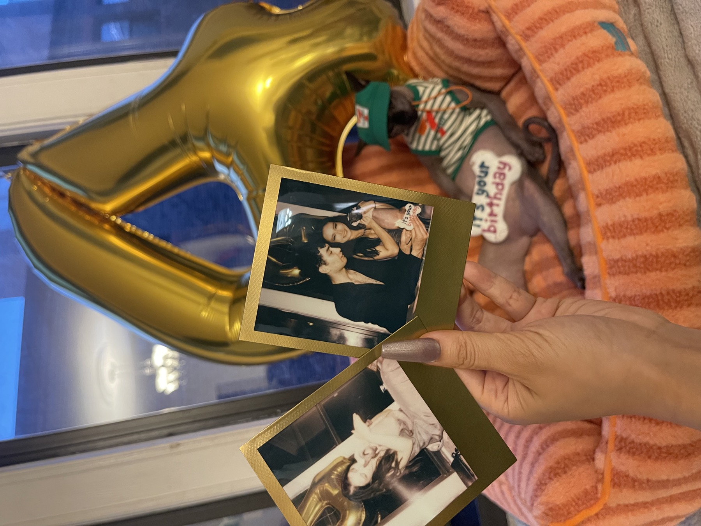
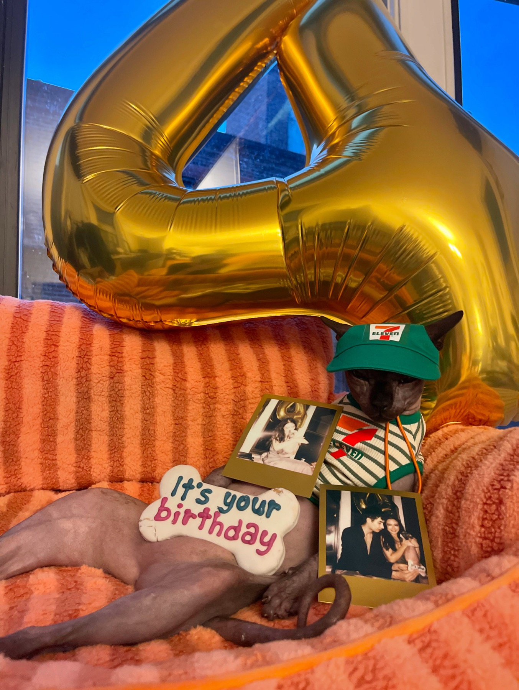

Bobo’s fourth birthday was his first proper birthday party, held in our first home in Boston. Because he has always preferred being cuddled to being left alone, the plan was simple: fill the apartment with friends and let him spend the evening moving from one set of welcoming arms to another.

<section class="birthday-story-section">
  <figure class="birthday-story-photo left">
    
  </figure>

  

    

    Before the guests arrived, we tried a few different outfits on Bobo. We eventually chose a lightweight tropical-print shirt that matched both the party’s summer dress code and the hot Boston weather. It made him look ready to host a tiny vacation in the middle of the living room.
    

  

</section>

<section class="birthday-story-section">
  <figure class="birthday-story-photo right">
    
  </figure>

  

    

    The birthday menu was built around seafood. We ordered sea urchin, salmon, tuna, and salmon roe from Maine and prepared a sushi buffet for the guests. Plain, unseasoned portions were kept separately so Bobo could share a few familiar ingredients while everyone ate together.
    

  

</section>

<section class="birthday-story-section">
  <figure class="birthday-story-photo left">
    
  </figure>

  

    

    During the party, Bobo met the guests one by one and received exactly what the celebration had promised: a great deal of attention. Once the humans settled into drinking and talking, he found a quiet spot and sat facing the camera, calmly observing the crowded room behind him.
    

    
  

    The scene captured his personality perfectly. He was part of the party without needing to remain in the middle of it every second. After taking a short break, he returned to the crowd and continued making his rounds.
    

  

</section>

<section class="birthday-story-section">
  <figure class="birthday-story-photo right">
    
  </figure>

  

    

    Throughout the evening, everyone took Polaroid photographs with Bobo. By the end of the party, the pictures had become a small visual guest book—a record of all the friends who had filled our first Boston home and helped give him an evening devoted entirely to companionship.
    

  

</section>

<section class="birthday-story-section">
  <figure class="birthday-story-photo left">
    
  </figure>

  

    

    We gathered some of the photographs around the large gold number-four balloon and used them as part of Bobo’s birthday portrait. The Polaroids preserved the individual cuddles and little interactions that would otherwise have disappeared into the movement of the party.
    

  

</section>

<section class="birthday-story-section">
  <figure class="birthday-story-photo right">
    
  </figure>

  

    

    For the final photographs, Bobo changed into his 7-Eleven uniform and settled into his orange couch, which had been shipped from China. He posed with his birthday cookie, the Polaroids, and the gold balloon behind him.
    

   
  

    The cookie had been made for dogs, and Bobo made it clear that he did not approve. Fortunately, the seafood—and the apartment full of people prepared to cuddle him—had already made the party a success.
    

  

</section>

