

Bobo’s fifth birthday took place in our second home in Boston. We originally wanted to take him outside for a picnic, but Bobo usually needs a long time to adjust to an unfamiliar outdoor environment. Instead of asking him to spend his birthday getting comfortable somewhere new, we brought back one of his favorite things: a home filled with people ready to give him human cuddles.

<section class="birthday-story-section">
<figure class="birthday-story-photo left">
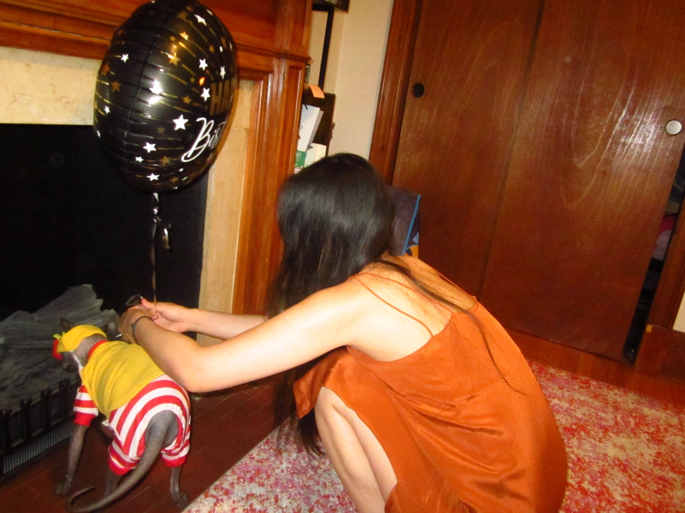
</figure>

Before the guests arrived, we helped Bobo into his McDonald’s-inspired fries outfit and finished arranging the birthday balloons. The costume looked extremely cool, although it was honestly not the most comfortable thing to wear. Even so, Bobo collaborated remarkably well while we adjusted everything. He seemed to understand that he was getting ready for an important shift: welcoming everyone into his home.

</section>

<section class="birthday-story-section">
<figure class="birthday-story-photo right">
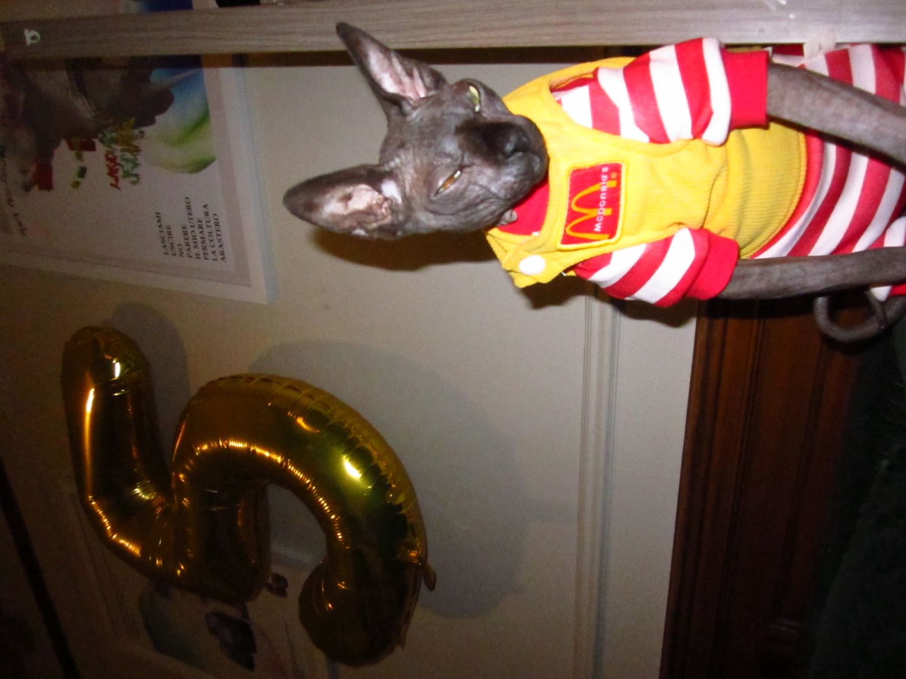
</figure>

Once he was dressed, Bobo immediately produced his model face. He sat upright beside the gold number-five balloon and looked toward the camera with a serious, almost intimidating expression. From the photograph alone, nobody would guess that his main birthday goal was simply to receive as many cuddles as possible.

</section>

<section class="birthday-story-section">
<figure class="birthday-story-photo left">
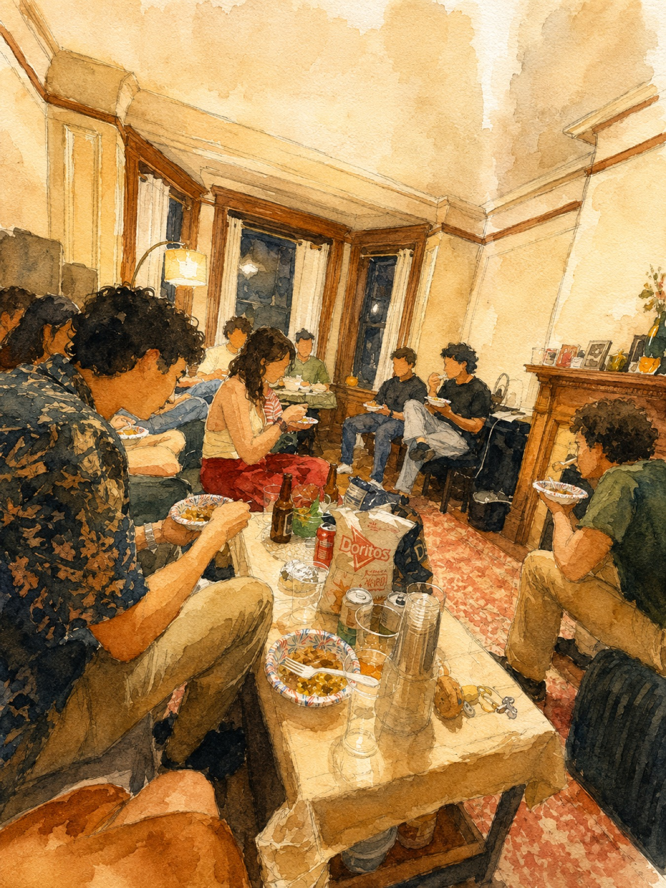
</figure>

This year, we did not repeat the elaborate seafood buffet from his fourth birthday. Bobo had already become accustomed to having a large crowd at home, so the plan could be much simpler: invite friends over for dinner, let everyone eat and talk, and allow Bobo to move through the party at his own pace.

</section>

<section class="birthday-story-section">
<figure class="birthday-story-photo right">
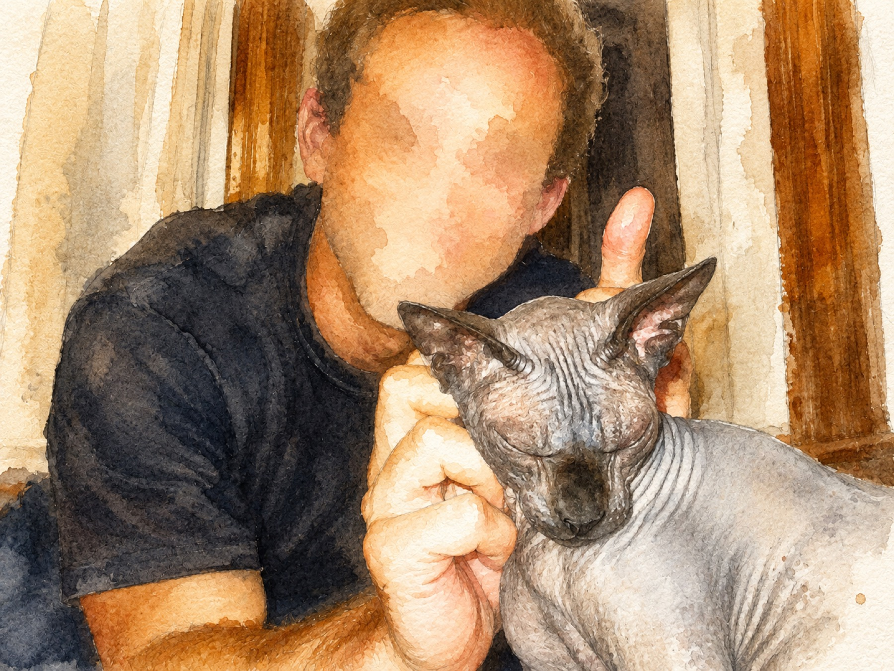
</figure>

Nobody called Bobo over, carried him from person to person, or forced him to remain anywhere. He decided whom he wanted to visit, where he wanted to sit, and when each interaction was finished. We wanted him to receive the same kind of respect we would give any other person at the party.

</section>

<section class="birthday-story-section">
<figure class="birthday-story-photo left">
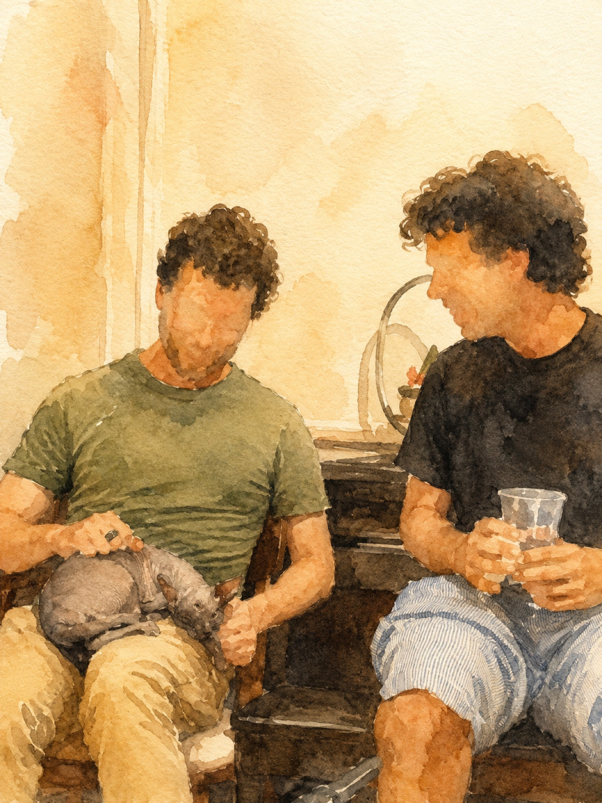
</figure>

Sometimes Bobo climbed onto someone’s lap and remained there for a very long time. At other moments, he stretched out and requested a belly rub. Once he found a comfortable person and position, he had no reason to hurry away.

</section>

<section class="birthday-story-section">
<figure class="birthday-story-photo right">
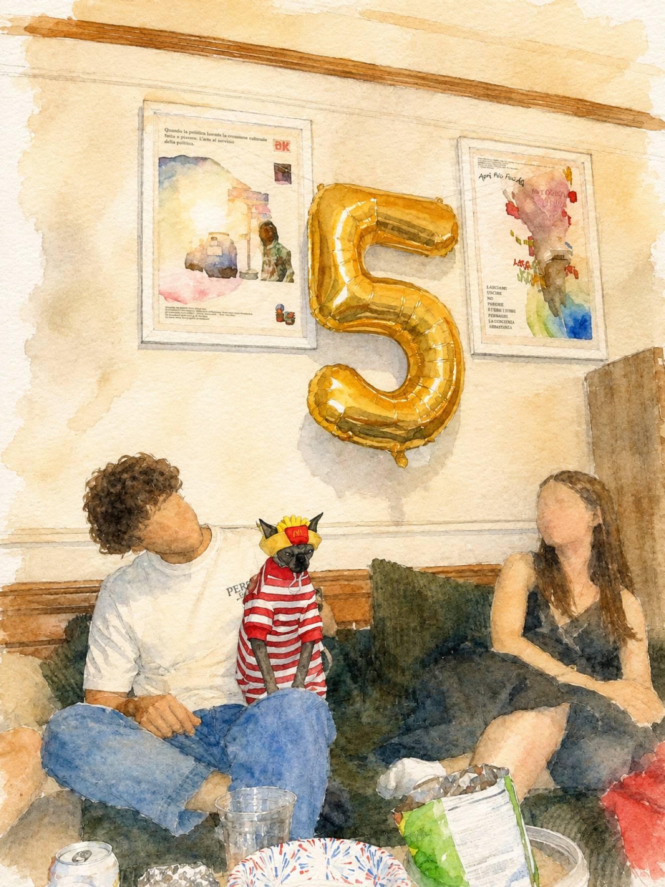
</figure>

As Bobo walked through the crowd, climbed onto the furniture, and sat among the guests, we sometimes wondered whether he believed he was simply one of the humans—only shorter. He participated naturally, joining the gathering in his own quiet way before moving to another part of the room.

</section>

<section class="birthday-story-section">
<figure class="birthday-story-photo left">
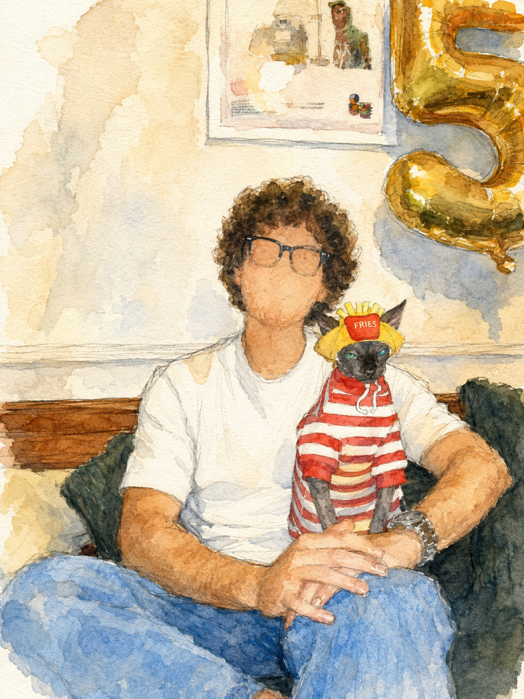
</figure>

Bobo continued visiting the guests one by one. Sometimes he sat upright beside someone as though he were another person joining the conversation. He never needed to be placed there or asked to stay. He chose the guest, settled into the seat, and remained for as long as he wanted.

</section>

<section class="birthday-story-section">
<figure class="birthday-story-photo right">
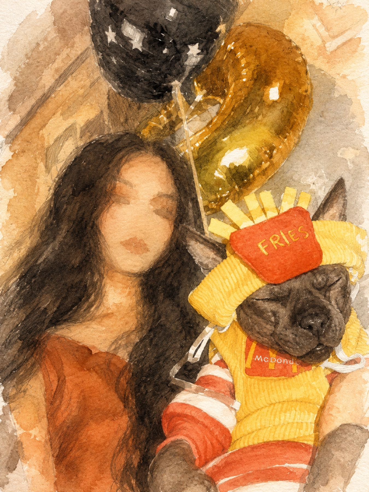
</figure>

Near the end of the evening, I took my own birthday photograph with Bobo. He remained patient while I experimented with the pose, but his own expression hardly changed. He already seemed to know exactly how he wanted to appear in the finished picture.

</section>

<section class="birthday-story-section">
<figure class="birthday-story-photo left">
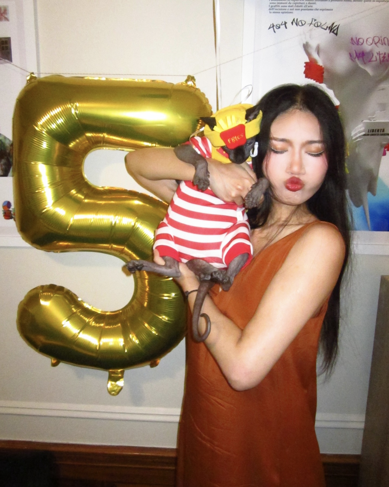
</figure>

The portraits also showed how comfortable Bobo had become with being held. Beneath the costume and the serious face, he was still enjoying the familiar closeness that had inspired the entire party. He may look stern in photographs, but being carried and cuddled is one of his favorite things.

</section>

<section class="birthday-story-section">
<figure class="birthday-story-photo right">
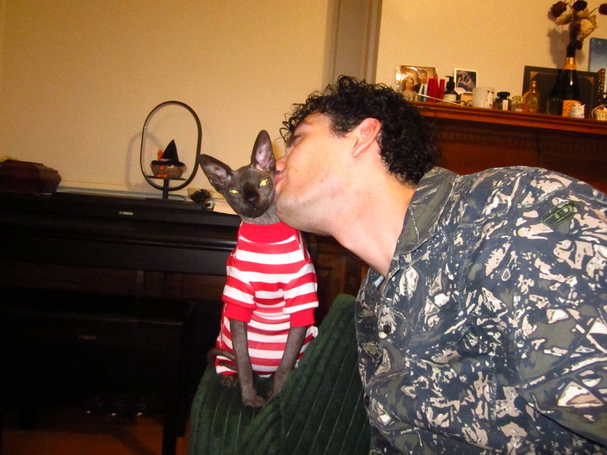
</figure>

Coco and Bobo also took their birthday photograph together. Because the three of us are the best roommates, the album would not have felt complete without pictures of the household. Coco gave Bobo a kiss while Bobo remained seated in his striped outfit, accepting the affection with his usual serious expression.

</section>

<section class="birthday-story-section">
<figure class="birthday-story-photo left">
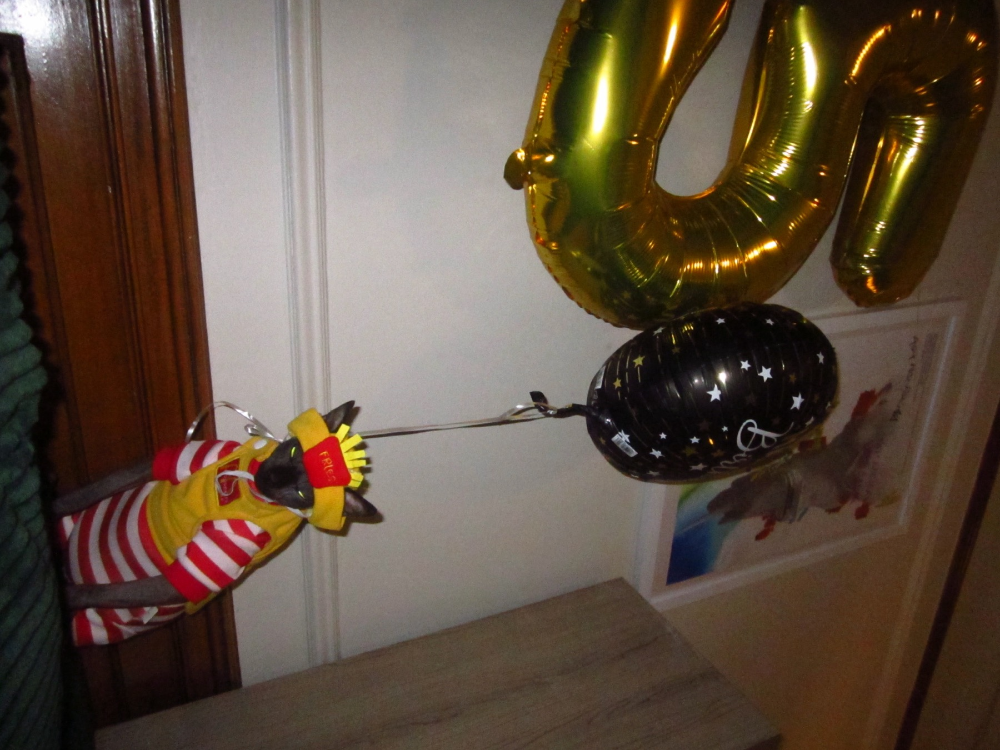
</figure>

Bobo’s formal solo portrait made us realize just how naturally he performs for a camera. He did not struggle with the pose, and he seemed to know exactly where to look. With the striped uniform, fries hat, balloons, and intense expression, he looked less like a house cat and more like the star of his own production.

</section>

<section class="birthday-story-section">
<figure class="birthday-story-photo right">
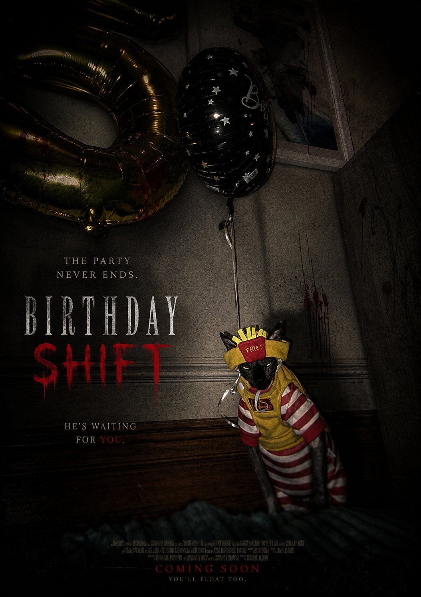
</figure>

One photograph looked so cinematic that we transformed it into a horror-movie poster. The dark room, birthday balloons, striped uniform, and Bobo’s serious face worked almost too perfectly. That was when we realized that Bobo might truly be superstar material.

The poster suggests that Bobo is waiting in the darkness for his next victim. In reality, he is probably waiting for someone to sit down so he can climb into their lap. That contrast—an intimidating face paired with a personality built almost entirely around cuddles—made his fifth birthday completely and unmistakably Bobo.

</section>

